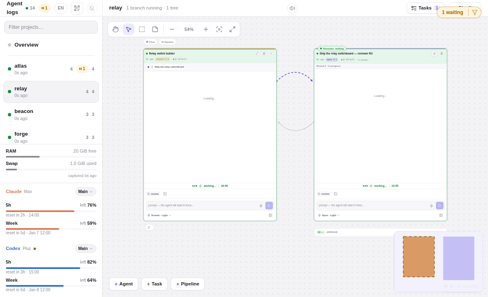
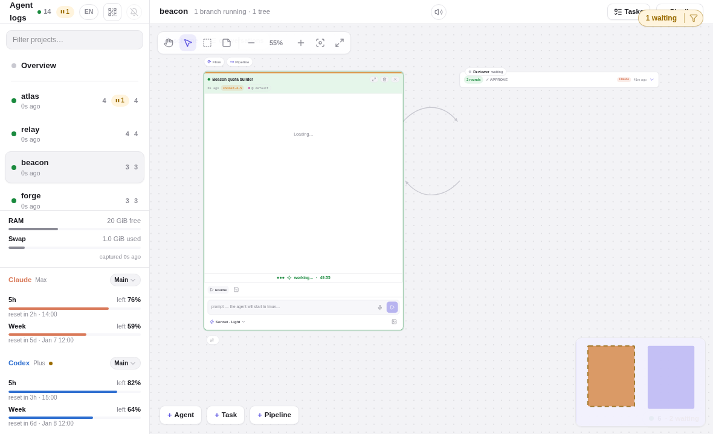
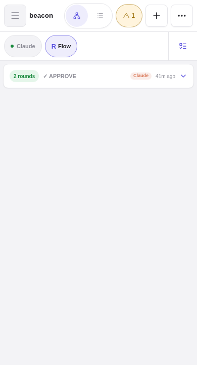

# Issues #289 + #325 visual acceptance — grouped, collapsible review conversations

Captured from the deterministic demo fixture home (`fixtures/demo-home`) through the shared
`scripts/demo-capture.ts` shot manifest: frozen clock (`2100-01-02T12:00Z`), double-render text
stability, element and pixel gates. Regenerate with `bun run demo:capture`.

The fixture adds two projects with direct one-shot review groups recorded in the durable agent
registry (`role=reviewer` lineage edges + `reviewsConversationId`, no flow/pipeline membership):

- **relay** — one board task (`task-demo-relay-review`) assigned to the builder; three reviewer
  transcripts: R1 `VERDICT: REQUEST_CHANGES`, R2 `VERDICT: APPROVE`, R3 still reviewing. The group
  keys as `task::task-demo-relay-review` and stays actionable.
- **beacon** — subject-keyed group (no task): R1 `REQUEST_CHANGES`, R2 `APPROVE` — a terminal group.

## Desktop 1180×720 · expanded group (active latest round)

The task-keyed group renders as one review deck beside the reviewed conversation: the active round
is the front card (`Round 3 · in progress` banner), the two verdict rounds lie under it as pullable
spines with their verdict chips. The deck container carries `role="group"` with a label naming the
reviewed conversation; every round is reachable without a nested scroll container.

## Desktop 1180×720 · collapsed group (terminal verdict)

After the durable final `APPROVE`, the group auto-collapses in place to its verdict chip — still a
board citizen at the deck anchor: rounds count, final verdict with tone, reviewer engine, and
recency. One click restores the full deck at the same spot; the collapse/expand transition is the
two-phase suck-in (skipped entirely under `prefers-reduced-motion`).

## Mobile 390×720 · collapsed group chip

The terminal group rides the switch strip as a deck chip; focusing it shows the collapsed verdict
chip — a 48px-tall tap target (≥ the 44px contract) that expands to the full deck in place.

