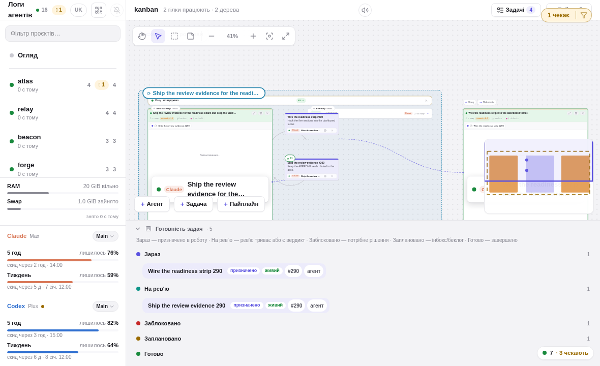
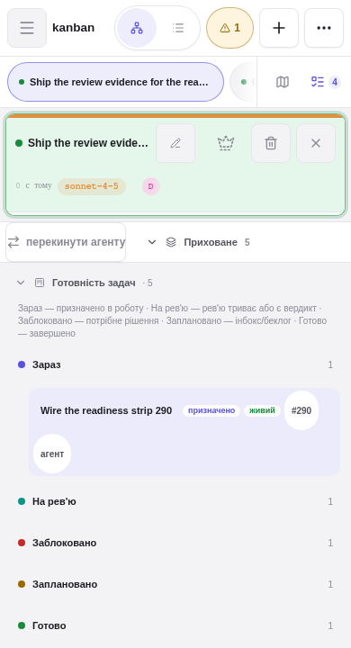

# Issue #290 visual acceptance — readiness Kanban sections for all board tasks

Captured from the deterministic demo fixture home (`fixtures/demo-home`) through the shared
`scripts/demo-capture.ts` shot manifest: frozen clock (`2100-01-02T12:00Z`), per-shot locale
(`llv_lang=uk`), double-render text stability, element and pixel gates. Regenerate with
`bun run demo:capture`.

The fixture adds a `kanban` project seeded so every readiness section is non-empty
(5 tasks → exact counts **Зараз 1 · На рев'ю 1 · Заблоковано 1 · Заплановано 1 · Готово 1**,
header total 5):

- `task-kanban-now` — `status=assigned`, delivered assignment to a plain builder transcript
  (no review links) → **Зараз**, with a `live` decoration and an `агент` navigation chip.
- `task-kanban-review` — `status=assigned`, assignment linked to flow `demo-kanban-readiness`
  (`state=approved`, round 1 `verdict=APPROVE`) → **На рев'ю**: durable verdict evidence, not
  emoji markers, moves a card into review.
- `task-kanban-blocked` — `status=blocked` → **Заблоковано**.
- `task-kanban-planned` — `status=inbox`, `placement=unplaced` (no `pos`) → **Заплановано**:
  unplaced GitHub-issue backlog cards stay visible in the board's readiness sections.
- `task-kanban-done` — `status=done` → **Готово**.

Classification is a pure function of one `/api/files` snapshot (task status, assignment states,
linked pipeline/flow states, persisted verdicts, alias map): no wall clock, no scanner liveness.
The fixture home has no git remote, so the `#290`/`#291`/`#292` issue references render as
plain-text chips instead of dead links; with a resolvable GitHub `origin` remote the server's
cached `projectCatalog.repository` turns them into external issue links.

## Desktop 1180×720 · strip expanded, «Зараз» and «На рев'ю» sections opened

The strip replaces the old status-stacks footer below the canvas in normal flow — canvas
placement code is untouched, so no card overlap is possible. Header shows «Готовність задач · 5»
(all project tasks, including the unplaced backlog card), a one-line `role="note"` legend states
each section's criterion, and every disclosure row carries `aria-expanded` plus a dot + text
heading + `tabular-nums` count (readiness is never color-only).

## Mobile 390×720 · strip inside the bottom shelf

The strip rides `MobileBottomShelf` (collapsed by default, so the active conversation stays
readable); the shelf badge counts every project task. Rows and chips are ≥44 px tap targets,
chips `flex-wrap` inside `min-w-0` containers, and the strip scrolls vertically only — the pixel
and element gates run at exactly 390×720, so any document-level horizontal scroll fails the
capture.

## Determinism and data preservation

- No migration: the feature is a read model. `tasks.json`, `board.json`, and the flow/pipeline
  stores are untouched; every task ID, text, source, assignment, placement, position,
  attachment and timestamp survives byte-for-byte
  (`src/components/tasks/taskReadiness.restart.test.ts` round-trips the real store).
- Reload/restart/alias-remap/deleted-worktree determinism is covered by
  `src/components/tasks/taskReadiness.test.ts` (totality grid, alias remap equivalence,
  vanished-transcript membership stability, deep-equal re-partition).
- Production spot-check (read-only `GET /api/files` on the live viewer): 130 tasks of project
  `-agents-tools-live-log-viewer-next` partition into `now=10 review=2 blocked=6 planned=60
  done=52`, sum 130 — matching the durable statuses (12 assigned split across now/review,
  60 inbox planned, 6 blocked, 52 done) with a deterministic re-partition.
