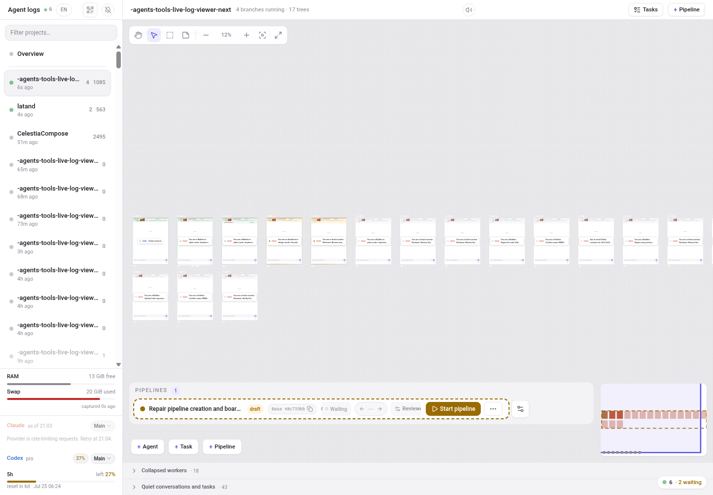
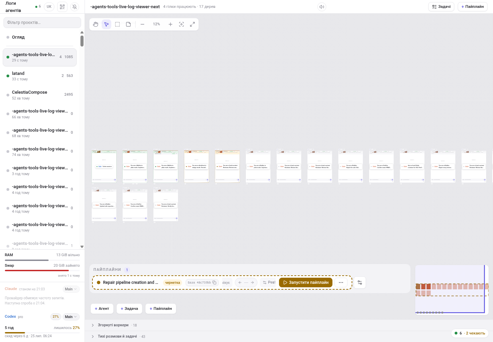
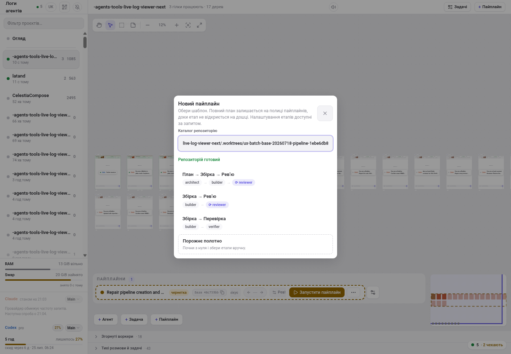
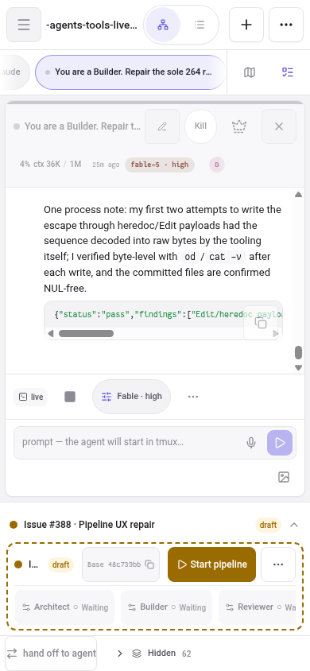
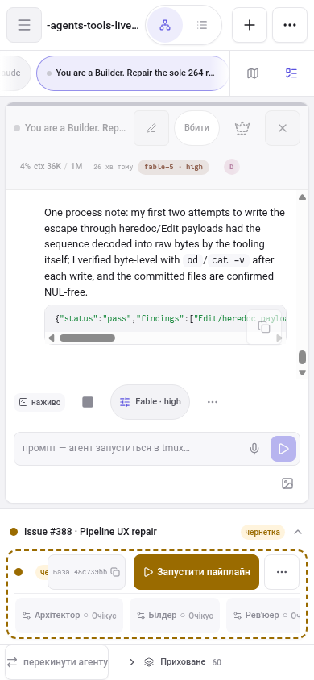

# Issue #388 visual acceptance

Captured from the optimized Next.js production build at `http://127.0.0.1:3388` with an isolated Viewer state directory.

## Desktop · English

The memberless draft lives in the screen-space shelf. The board world and minimap retain conversation-only geometry.

## Desktop · Ukrainian

Repository admission reaches the ready state before template selection. The picker keeps the canonical path and localized status visible.

## 390px · English

The dock keeps the title/status region, short base commit, primary action, overflow trigger, and horizontally scrollable labeled stage rail within the viewport.

## 390px · Ukrainian

