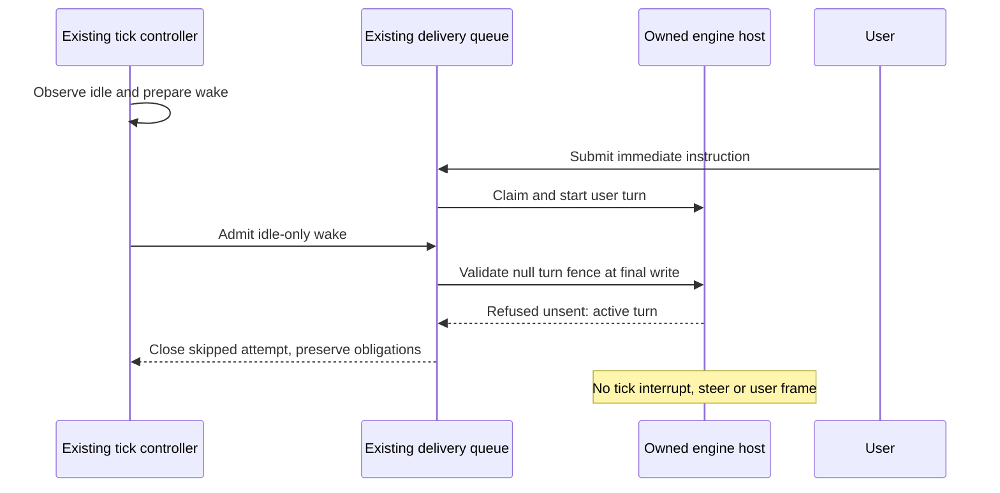

# Synthetic UX examples

All messages, names and times in these examples are invented. These textual mockups describe proposed behavior. Rendered production behavior needs separate verification.

## Composer and queue

Default a fresh submission to **After this turn** while a turn is active. Keep the chosen mode visible. An idle conversation uses **Send** with the same safe queue policy: it starts as soon as host admission proves idle. A remembered mode must never silently turn a protected submission into an immediate one after reload. Voice-dictated text, quick acknowledgment and keyboard submission use the same mode snapshot; live voice streaming is outside this slice.

```text
Assistant · Working · Running checks

After this turn · 2 messages
1  Also check the small-screen layout.          Queued   Edit  Cancel
2  Include the result in the handoff.           Queued   Edit  Cancel

[ Add another instruction…                              ]
[ After this turn ▾ ]                           [ Queue ]

Menu:
  After this turn
  Send now — interrupts current work
```

“Queued” appears only after server acceptance. Before that, the row says “Saving…” and its bytes survive a reload. The composer remains available for the next draft. Queue entries show full text and attachment previews on opening. Order/target changes from another device update the same rows by stable presentation identity.

```text
Assistant · Ready

1  Also check the small-screen layout.       Sending…
2  Include the result in the handoff.        Queued · after message 1

Assistant · Working on message 1
1  Also check the small-screen layout.       Delivered
2  Include the result in the handoff.        Queued · after this turn
```

After message 1 is delivered, message 2 still waits for its turn to complete. “Delivered” establishes the message arrived at the agent; it does not claim the agent finished or complied with the instruction.

## Truthful labels

| Internal evidence | User-facing state | Allowed action |
| --- | --- | --- |
| Local row, request not durably accepted | Saving… / Saved on this device | Edit/cancel only when never dispatched locally |
| Durable server acceptance, waiting for completed turn | Queued · after this turn | Inspect; edit/cancel if server proves unsent |
| Durable server acceptance, prior queue row outstanding | Queued · after message N | Same |
| Blocking approval/request | Queued · waiting for your answer | Open original question/approval |
| Known quota/auth hold | Queued · waiting for account availability | Inspect reason; use existing recovery |
| Host accepted dispatch claim, awaiting arrival evidence | Sending… | Inspect; editing/cancellation locked |
| Provider RPC accepted but canonical evidence incomplete | Accepted by agent · verifying arrival | Reconcile original key |
| Canonical matching user message/broker receipt | Delivered | Inspect |
| Possible actuation with incomplete evidence | Delivery unknown · checking receipt | Verify original operation; preserve payload |
| Proven rejection before actuation | Not delivered · reason | Existing safe retry with authoritative eligibility |
| Cancel won the never-actuated transaction | Cancelled before sending | Read cancelled history |
| Edit is crossing its fenced mutation steps | Updating… | Reconcile edit key; retain both versions |
| Stale client edit/cancel revision | This message changed on another device | Refresh latest version; preserve local edit draft |
| Error/interrupted terminal turn | Queue paused · turn did not complete | Continue queue when idle; edit/cancel if eligible |
| Logical target superseded | Target changed · message still queued here | Inspect original; explicit safe move if unsent |

An API `queued` or `accepted` response never renders as Delivered. A vanished outbox row never renders as proof of delivery. An uncertain discard never renders as “Cancelled before sending.”

## Immediate option

```text
Two messages will remain queued.
[ New urgent instruction…                              ]
[ Send now ▾ ]                             [ Send now ]
```

Send now is explicitly interrupting behavior using the current `interrupt-active` contract. The button/menu text communicates this directly; no confirmation modal is needed. It may overtake unsent after-turn rows once any existing handover is resolved. A submitted message keeps the mode chosen at its own submission. Changing the dropdown affects the next draft only.

## Safe editing and cancellation

```text
Editing queued message 2
[ Include the checks and any remaining limitation.     ]
[ Cancel edit ]                         [ Save changes ]

If dispatch wins during the edit:
This message is already being sent. Your edit is saved as a draft.
[ Return to queue ]                    [ Open follow-up draft ]
```

Cancelling removes only a proven unsent version. A cancelled tombstone remains in durable history for replay protection. A failed cancellation leaves the real sending/delivered/unknown state visible. Attachments remain available while either the original operation or an edit outcome is unresolved.

## Tick and admission sequences



```mermaid
sequenceDiagram
    participant U as Two user clients
    participant Q as Existing journal and queue
    participant H as Owned engine host
    U->>Q: Queue A, then B in server order
    Q-->>U: Accepted, positions 1 and 2
    H-->>Q: Current turn completed, idle
    Q->>H: Claim A, null fence, start reservation
    H-->>Q: Canonical arrival A
    Q-->>U: A delivered; B waiting
    H-->>Q: A turn completed, idle
    Q->>H: Claim B, null fence, start reservation
```

Tick status uses the existing chip/journal: “Skipped · turn active,” “Deferred · state unavailable,” “Skipped · user messages waiting,” or last confirmed wake time. It should not create a pending user bubble for a tick that was refused unsent. An unresolved attempted tick remains visible through the existing outstanding-wake status.

## Render acceptance

Check keyboard mode selection, Enter/Send/quick-ack equivalence, accessible labels and focus retention while receipts arrive. At 390 px width, show order, short status and controls without covering the draft; use at least 44 px touch targets. Existing offscreen board dormancy must pause UI work while queue persistence/recovery continues. Reentry shows the newest queue revision and retains draft, selection and scroll. Actual rendered/browser evidence belongs to implementation acceptance.
